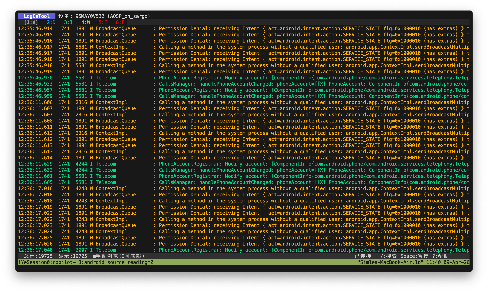

# LogCaTool

基于 [Bubble Tea](https://github.com/charmbracelet/bubbletea) 的 Android Logcat 终端查看器，目标是提供接近 Android Studio Logcat 的实时查看、过滤和定位体验。



## 特性

- **实时日志流**：通过 ADB 实时查看设备日志
- **离线文件模式**：读取已保存的 logcat 文件，也可按时间戳回放
- **多设备支持**：多设备连接时可选择目标设备
- **最低日志级别过滤**：按 V / D / I / W / E / F 切换最小显示级别
- **组合过滤**：支持搜索、Tag、Tag 黑名单、PID、包名、进程名、崩溃模式、时间范围组合过滤
- **包名 / 进程名筛选**：从设备进程列表构建映射，支持 Android 子进程名如 `com.app:remote`
- **应用选择器**：`p` 打开应用列表，支持输入搜索、`j/k` 移动、`Enter` 选择、`F` 收藏
- **统计面板**：查看最活跃的级别 / Tag / 应用 / 进程，并可直接应用过滤
- **过滤预设**：3 个预设槽，支持保存 / 切换 / 清空，**重启后自动恢复**
- **命名过滤配置**：按 `U` 管理可命名过滤配置，支持保存、应用、重命名、删除，**重启后自动恢复**
- **重复折叠**：折叠连续重复日志并显示计数
- **详情面板**：查看当前聚焦日志的完整原始内容
- **暂停不丢日志**：暂停时缓存新日志，恢复后补入
- **书签跳转**：标记关键日志并在书签间跳转
- **收藏应用 / 进程**：在应用列表和统计面板中置顶常用项，**重启后自动恢复**
- **告警提示**：崩溃或自定义关键词命中后在状态栏提示，**重启后自动恢复**
- **异常上下文**：按 `Y` 查看异常检测历史，面板内展示异常时间窗口的级别 / Tag / 应用 / 进程摘要
- **离线回放 / Diff**：`--replay` 按日志时间戳回放文件，`--diff-base` / `--diff-candidate` 比较两份日志
- **搜索历史**：输入搜索时按 `↑/↓` 快速翻阅最近 20 条搜索记录
- **跳转到时间**：按 `T` 输入时间戳（如 `14:32:05` 或 `-5m`）快速定位日志
- **崩溃栈折叠**：在崩溃模式下按 `o` 折叠/展开连续栈帧
- **JSON 导出**：按 `Ctrl+e` 导出结构化 JSON 日志
- **高级导出面板**：按 `O` 选择 Text / JSON / CSV / NDJSON 与过滤 / 书签 / 可见窗口 / 异常窗口范围
- **日志频率图**：状态栏实时显示最近 20 秒日志量 ASCII 趋势图
- **配置持久化**：收藏、预设、告警关键词、界面状态自动保存到 `~/.config/logcatool/config.json`
- **性能优化**：手写解析、虚拟滚动、缓存渲染，适合长时间跑日志

## 前置条件

- Go 1.25+
- Android SDK Platform Tools（`adb` 可用）
- Android 设备已开启 USB 调试（实时模式）

## 安装

### 方式一：直接安装

```bash
go install github.com/Yecangyuan/LogcatTool@latest
```

安装后可执行文件会出现在 `$GOBIN`（未设置时通常是 `$GOPATH/bin`）里。

### 方式二：从源码构建

```bash
git clone https://github.com/Yecangyuan/LogcatTool.git
cd logcatool
go build -o logcattool .
```

> 二进制名称取决于你的安装 / 构建方式。下面的命令示例统一使用 `logcattool` 代称；如果你本地构建成了 `LogcatTool`，把命令名替换成对应文件名即可。

## 使用

### 实时查看设备日志

```bash
logcattool
```

### 指定设备

```bash
logcattool -s <设备序列号>
```

### 读取日志文件

```bash
logcattool -f logcat.txt
```

### 按时间戳回放日志文件

```bash
logcattool -f logcat.txt --replay --replay-speed 2
```

回放模式下可在 TUI 内按 `+` / `-` 调整后续回放速度，按 `Space` 暂停 / 恢复。

### 比较两份日志

```bash
logcattool --diff-base before.txt --diff-candidate after.txt
```

### 自定义缓冲区大小

```bash
logcattool -n 100000
```

## 参数

| 参数 | 说明 | 默认值 |
|------|------|--------|
| `-f` | 从日志文件读取 | - |
| `-s` | 指定设备序列号 | 自动选择 |
| `-n` | 本地日志缓冲区大小 | 50000 |
| `--replay` | 对 `-f` 文件按日志时间戳回放 | false |
| `--replay-speed` | 回放速度倍率 | 1 |
| `--diff-base` | Diff 基线日志文件 | - |
| `--diff-candidate` | Diff 候选日志文件 | - |
| `-v` | 显示版本信息 | - |
| `--debug` | 开启调试日志 | - |

## 常用工作流

### 1. 按应用筛选

按 `p` 打开应用选择器：

- 输入关键字快速搜索应用
- `j/k` 或方向键移动
- `Enter` 应用包名过滤
- `F` 收藏 / 取消收藏应用
- `Esc` 取消

### 2. 按进程筛选

按 `P` 输入进程名片段即可过滤，对 Android 子进程也有效，例如：

```text
com.huawei.smarthome.extend:p9
```

### 3. 快速定位异常日志

常见组合：

- `5` / `6`：只看 Error / Fatal
- `x`：只看崩溃相关日志
- `/`：输入关键词或正则
- `A`：设置告警关键词，在状态栏提示命中

### 4. 查看异常上下文

按 `Y` 打开异常检测面板：

- `j/k` 选择异常事件
- `Enter` 将选中异常应用为过滤条件
- `Ctrl+e` 导出选中异常的事件元数据、上下文摘要和窗口日志
- `c` 清空异常历史

### 5. 从统计面板反向过滤

按 `a` 打开统计面板：

- `j/k` 选择项
- `Enter` 直接应用该项过滤
- `F` 收藏应用 / 进程
- `a` 或 `Esc` 关闭

### 6. 保存常用过滤组合

- `m`：保存当前过滤到当前预设槽（重启后自动恢复）
- `[` / `]`：切换并加载预设槽
- `M`：清空当前预设槽
- `U`：打开命名过滤配置面板，可保存、应用、重命名、删除更多配置

### 7. 跳转到指定时间

按 `T` 输入时间：

- 绝对时间：`14:32:05`、`14:32:05.123`
- 相对时间：`-5m`（5 分钟前）、`-30s`、`-2h`

### 8. 崩溃栈折叠

在崩溃模式下（`x`）选中栈帧行，按 `o` 折叠/展开连续栈帧。

### 9. 导出结构化日志

- `e`：导出为纯文本
- `Ctrl+e`：导出为 JSON（含时间、PID、TID、级别、Tag、消息等字段）
- `O`：打开导出面板，选择导出格式和范围

### 10. 搜索历史

在搜索输入框（`/`）中：

- `↑`：翻阅上一条搜索历史
- `↓`：翻阅下一条搜索历史
- 最近 20 条搜索自动保存到配置

## 快捷键

### 导航

| 按键 | 功能 |
|------|------|
| `↑` / `k` | 向上滚动 |
| `↓` / `j` | 向下滚动 |
| `PgUp` | 上翻页 |
| `PgDn` | 下翻页 |
| `Ctrl+u` | 上半页 |
| `Ctrl+d` | 下半页 |
| `g` / `Home` | 跳到顶部 |
| `G` / `End` | 跳到底部 |
| 鼠标滚轮 | 上下滚动 |

### 过滤与搜索

| 按键 | 功能 |
|------|------|
| `/` | 搜索（有效正则按正则匹配，否则按普通文本匹配） |
| `t` | Tag 过滤 |
| `E` | Tag 黑名单 |
| `p` | 应用包名选择器 |
| `P` | 进程名过滤 |
| `i` | PID 过滤 |
| `x` | 崩溃模式 |
| `r` | 切换时间范围（全部 / 10 秒 / 1 分钟 / 5 分钟） |
| `1` | 最低级别切到 Verbose |
| `2` | 最低级别切到 Debug |
| `3` | 最低级别切到 Info |
| `4` | 最低级别切到 Warn |
| `5` | 最低级别切到 Error |
| `6` | 最低级别切到 Fatal |

### 操作

| 按键 | 功能 |
|------|------|
| `Space` | 暂停 / 恢复日志流 |
| `+` / `-` | 回放模式加速 / 减速 |
| `c` | 清空当前日志，并清理设备 logcat buffer |
| `d` | 选择设备 |
| `e` | 导出当前过滤结果（文本） |
| `Ctrl+e` | 导出当前过滤结果（JSON） |
| `O` | 打开导出面板（Text / JSON / CSV / NDJSON，支持过滤 / 书签 / 可见窗口 / 异常窗口范围） |
| `b` | 添加 / 移除当前日志书签 |
| `n` / `N` | 下一个 / 上一个书签 |
| `a` | 打开统计面板 |
| `Y` | 打开异常检测面板（面板内 `Ctrl+e` 导出异常上下文） |
| `F` | 收藏当前应用 / 进程，或在面板 / 列表中收藏 |
| `A` | 设置告警关键词 |
| `z` | 切换重复折叠 |
| `o` | 折叠 / 展开崩溃栈帧 |
| `v` | 切换详情面板 |
| `w` | 切换换行 / 截断 |
| `s` | 切换自动滚动 |
| `B` | 切换 logcat buffer（All / Main / System / Crash / Events） |
| `y` | 复制当前日志行 |
| `T` | 跳转到指定时间 |
| `m` | 保存当前预设 |
| `M` | 清空当前预设 |
| `[` / `]` | 切换并加载预设槽 |
| `U` | 打开命名过滤配置面板 |
| `?` | 打开帮助面板 |
| `q` / `Ctrl+c` | 退出 |

## 性能与行为说明

- 使用**虚拟滚动**，只渲染可见日志行
- 使用**手写解析器**替代正则解析 threadtime 行
- 每条日志会缓存基础渲染结果，减少重复样式计算
- 书签只对仍在本地缓冲区中的日志有效；当旧日志被 ring buffer 淘汰后，对应书签会自动清理

## 许可证

MIT
